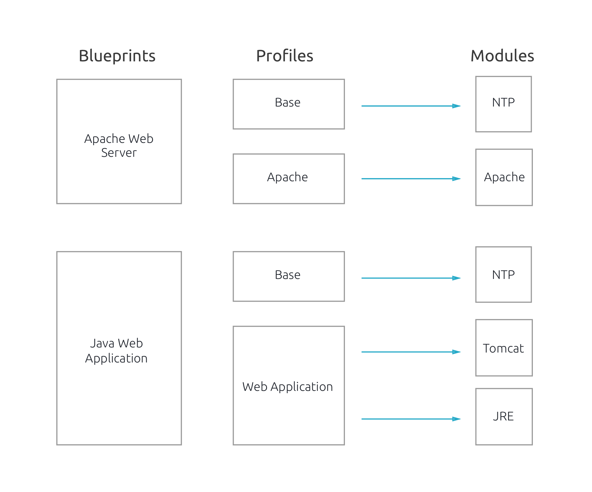

A Blueprint is what can be assigned to an [instance](/core-concepts/instances). The end result would be having a fully configured server with the software and services present in the blueprint.

Blueprints contain one to many [profiles](/core-concepts/profiles), each profile contains one to many modules. When you assign a blueprint to an instance, ultimately all the modules will be installed in your instance.

Every Module has its own set of parameters, a Blueprint will eventually be the sum of all parameters of its modules.
 
 

### Abstraction gives flexibility
Our modules are now abstracted by profiles, then by blueprints. This way of organization offers flexibility and reusability of pieces of software across your instances.

The following examples illustrate how we can benefit from modules abstraction.
The same profile `base` is used two times in two different architectures.

 
 