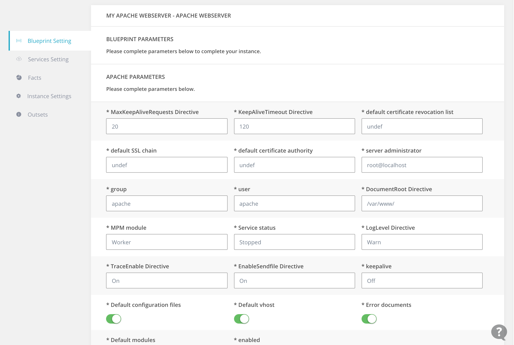

Modules are the Puppet templates that store the automation process in charge of installing and deploying softwares and services into [instances](/core-concepts/instances).

Umbreo helps by concretizing the modules and making their parameters configurable through an easy User Interface.
<br /> 
<br /> 
### What is Puppet?
Puppet is an open-source software configuration management tool that runs on *nix systems as well as Windows. It includes its own ruby-like declarative language to describe the configuration process.

Any Puppet setup consists of a Puppet Master which is a server having `puppetmaster` package installed  in charge of managing configurations up to many servers.

>Puppet uses its own configuration language, which was designed to be accessible to sysadmins. The Puppet language does not require much formal programming experience and its syntax was inspired by the Nagios configuration file format.

You can read more about Puppet <a href="https://docs.puppet.com/puppet/3.8/reference/" target="_blank">here</a>.
<br /> 
<br /> 
### Puppet Modules
Puppet also has modules as a core concept. Puppet modules are constituted of one or more Puppet classes defined inside files ending with a `.pp` extension. 

Each Puppet class holds all the parameters and configurations needed that ultimately install and configure a software or a service in a server.
<br /> 
<br /> 
#### Example 1 : Class that installs and configures Apache.
```ruby
class apache (
	$version = 'latest',
	$service_ensure = "running",
	$service_enable = true,
){
  package {'apache2':
    ensure => $version,
    before => File['/etc/apache.conf'],
  }
  file {'/etc/apache2.conf':
    ensure  => file,
    owner   => 'apache',
    content => template('apache/apache.conf.erb'),
  }
  service {'apache2':
    ensure    => $service_ensure, # Using the class parameter from above
    enable    => $service_enable,
    subscribe => File['/etc/apache.conf'],
  }
}
```
<br /> 
-----
### What Umbreo made out of Puppet modules?
Umbreo's role consists of translating the Puppet modules into manageable plugins that can be easily configured through a User Interface.
<br /> 
<br /> 
#### Screenshot : Example of configuring an advanced Apache module through Umbreo's UI

<br />
<br />
-----
### Modules when using Umbreo locally
Umbreo has also made the process of integrating modules into the UI very accessible and customized by everyone if you are considering using Umbreo locally and your own Puppet Master. Read more about using Umbreo locally [here](/developers/endpoints).

In order to make a module configurable through the UI, additionally to the traditional Puppet structure, in Umbreo each Puppet module has an `umbreo.json` in its directory that describes the parameters and provides information about the module that will be used in the UI.

By using our ruby command line interface gem <a href="https://rubygems.org/gems/umbreo_cli" class="gem_highlight" target="_blank">umbreo_cli</a> you can easily generate the JSON configuration file using module commands.

Let's retake our previous [example](#example-1-class-that-installs-and-configures-apache) and generate a JSON configuration file using the module command `umbreo module init` 

The generated file will be as follows :

```json
{
  "name": "apache",
  "parameters": [
    {
      "name": "version",
      "displayed": "Version",
      "description": "",
      "default": "latest",
      "type": "string",
    },
    {
      "name": "service_ensure",
      "displayed": "Service Ensure",
      "description": "",
      "default": "running",
      "type": "string",
    },
    {
      "name": "service_enable",
      "displayed": "Service Enable",
      "description": "",
      "default": true,
      "type": "boolean",
    }
  ],
  "informations": {
    "display_name": "Apache Web Server",
    "data": {
    }
  }
}
```
<br /> 
The generated file will be imported and parsed by Umbreo, each parameter is converted into an input field able to store a value.

-----

Read more about Umbreo Command Line Interface [here](/developers/cli.md).

Read more about adding new modules to Umbreo [here](/developers/endpoints.md).


