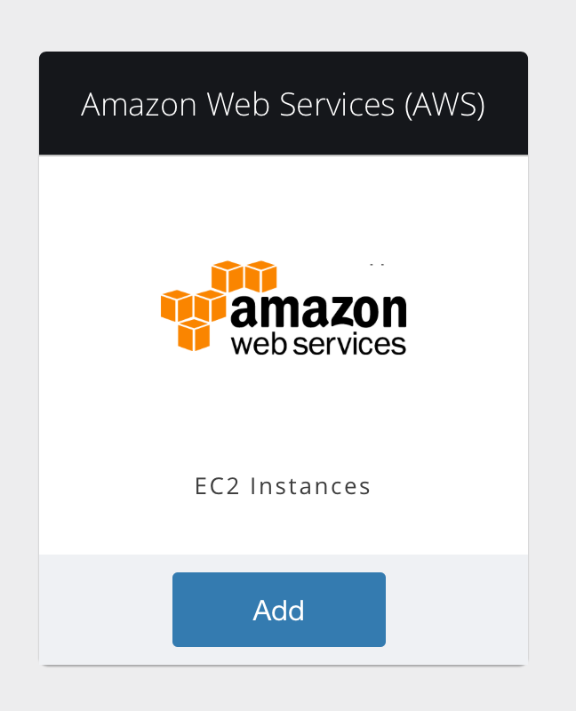
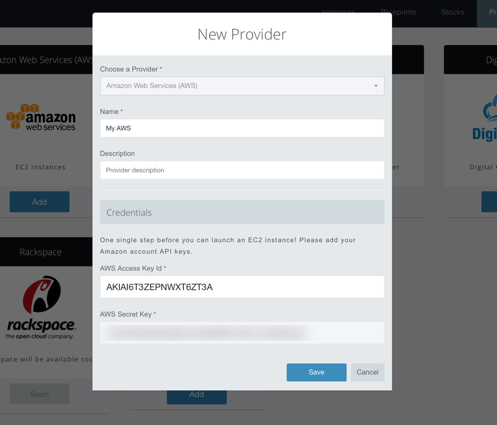

*The tutorial assumes that you already created an account and you're logged in to the Umbreo Dashboard. you will need also a valid AWS account.*

*Also for demonstration purposes we'll be deploying the **Docker** blueprint, but Umbreo has more than a dozen handcrafted, ready to use [Blueprints](/core-concepts/blueprints) so you can quickly and easily get started.*

### 1. Connect Cloud Provider

First, we need to create a new provider, so make sure you're on the [Providers](https://beta.umbreo.com/providers) page.

Since we'll be using AWS EC2, Click on the **Add** button on the card representing <b>Amazon Web Services</b> (as shown in the screenshot below).

A form will appear, where you can give a name for your that provider (optionally, you can add a description too), also make sure to enter valid AWS API keys. Finally click **Save** to move to the next step.

If AWS API keys were correct, your new provider should appear in the provider list and have state *Available*.

### 2. Deploy Blueprint

Now that we've connected a **Cloud Provider**, it's time to deploy a Blueprint. 

To do so, let's go to the [Blueprints](https://beta.umbreo.com/blueprints) page and click  the **Deploy** button on the card representing Docker.

A form will appear asking you to give a unique name to the instance (which we'll be automatically created for you in just a minute), make sure you select the **Auto provisioned** option, choose the provider we created in the previous step, and then click the **Done** button. 

### 3. Launch Instance 

On the next screen click **Launch Instance**.

An EC2 instance we'll be automatically provisioned on your behalf and configured with the Blueprint we chose in the previous steps. (In this how-to guide we chose to deploy Docker). 

Give it few minutes and your server instance we'll be ready for showtime! 