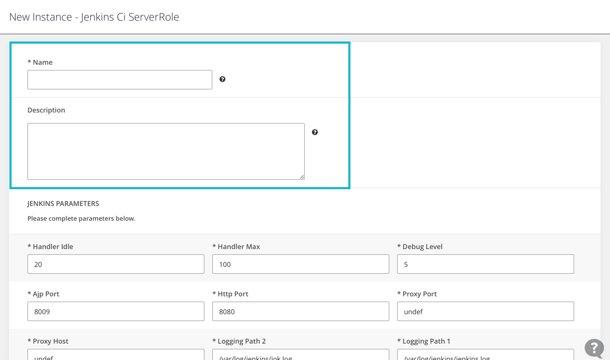
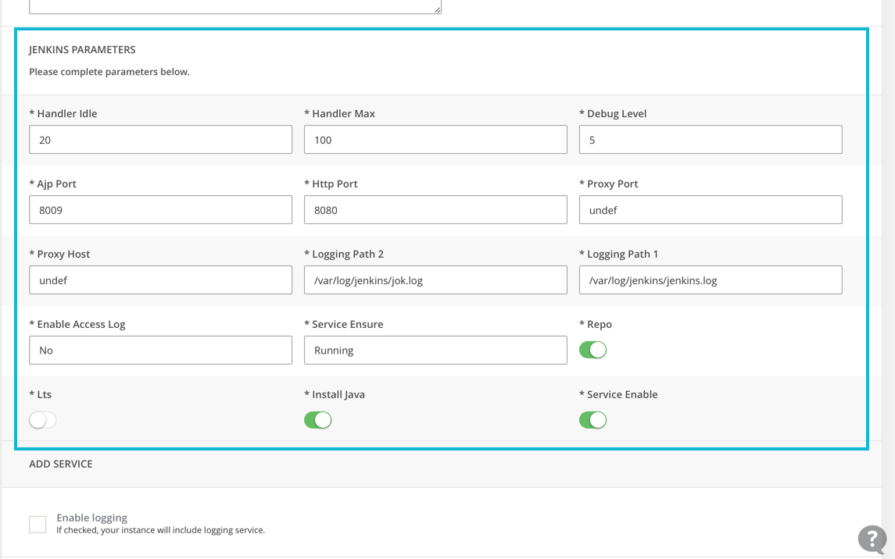
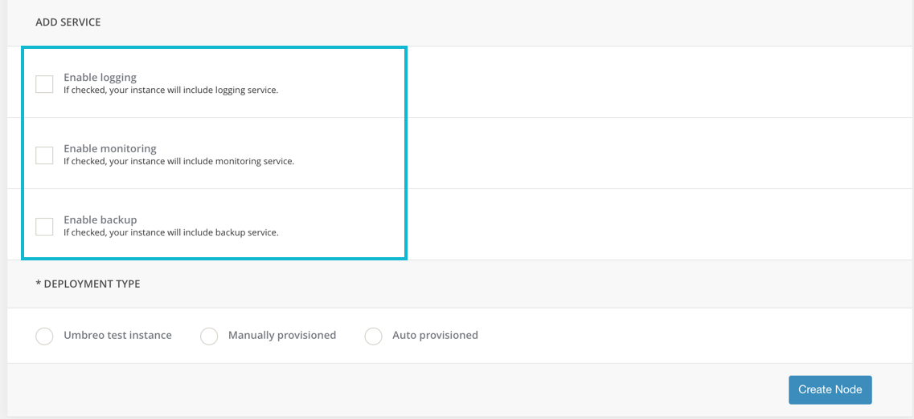
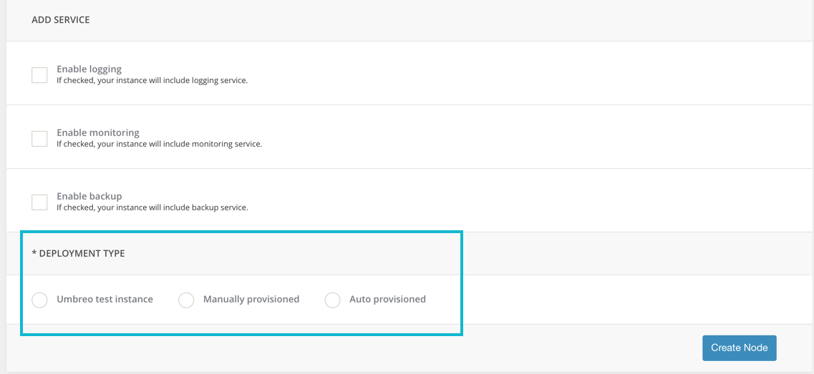
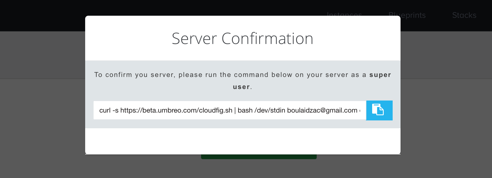

*This tutorial assumes that you have already created an account and you're logged in to the [Umbreo Dashboard](https://www.umbreo.com/instances).*

*For demonstration purposes we'll be deploying the Jenkins CI blueprint, Umbreo has more than a dozen handcrafted [Blueprints](https://www.umbreo.com/blueprints) ready to use, so you can quickly and easily get started in **3 easy steps**.*

 

### 1. Pick a Blueprint

Head to the [Blueprints](https://www.umbreo.com/blueprints) page. We'll be deploy a *Jenkins CI Server*, Click on the **Deploy** button inside the Jenkins CI Server blueprint box, and you'll be redirected to the page where you can start baking your instance.

 

 
 

### 2. Describe your Instance 

Choose a name to your new instance for display, and maybe you want to describe it more.

 
 	

### 3. Configure your Instance

In the same page, you can adjust the parameters of your *Jenkins Server* according to your needs.

 
 

<!-- ### 4. Select a Service (optional)

If you want to integrate a service like monitoring or logging, you can consider this section.

 
 
 -->

### 4. Type of instance

Choose the type of your instance, it's recommended to start with **Manually Provisioned** instance or Umbreo online instance to start.

 

### 5. Running your instance

Copy the cURL command to your clipboard and run it in your in your VM.

 

The command will connect your server first to the Umbreo Platform, then securely configure it with the Blueprint you chose in the previous steps.

Congrats! Your Jenkins instance is ready.

 

