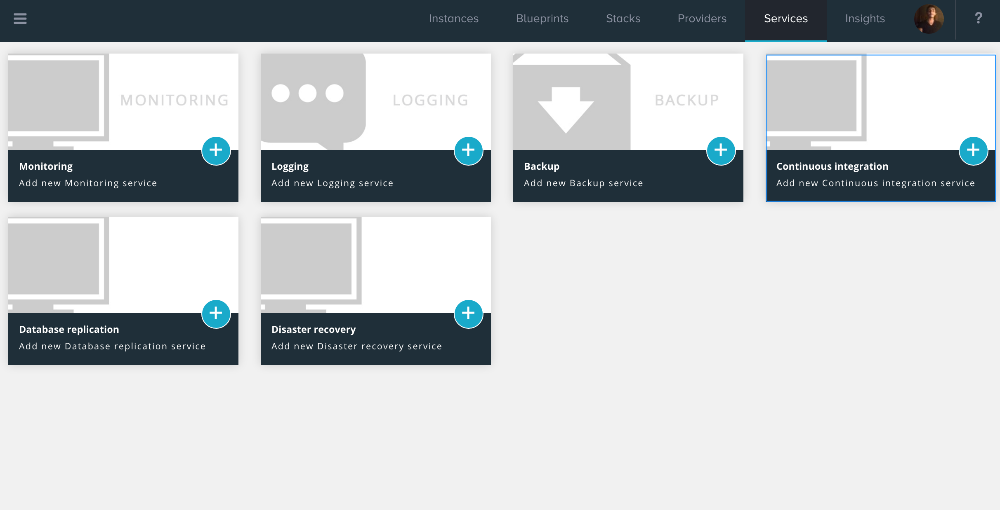
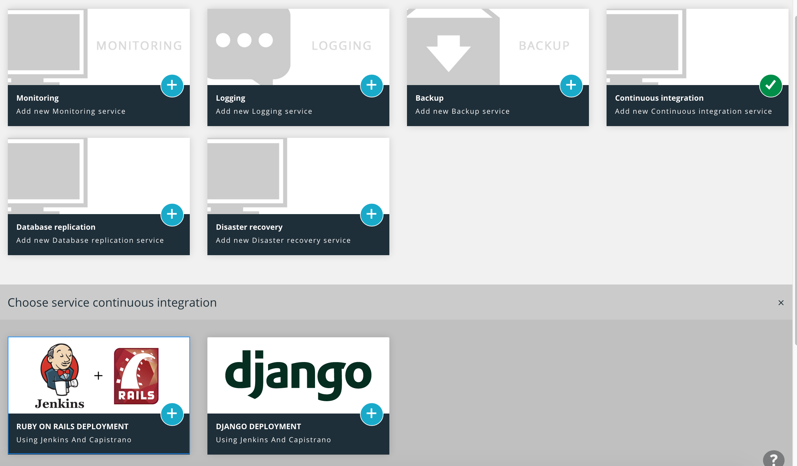
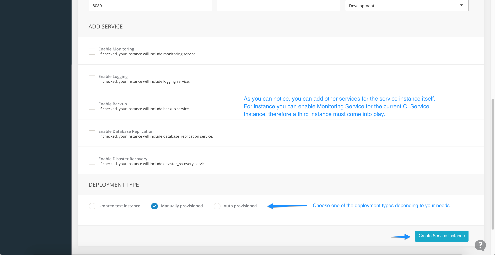
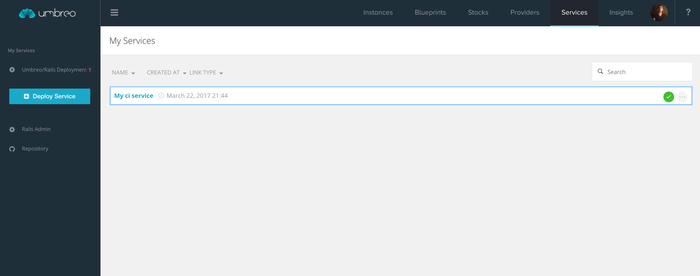
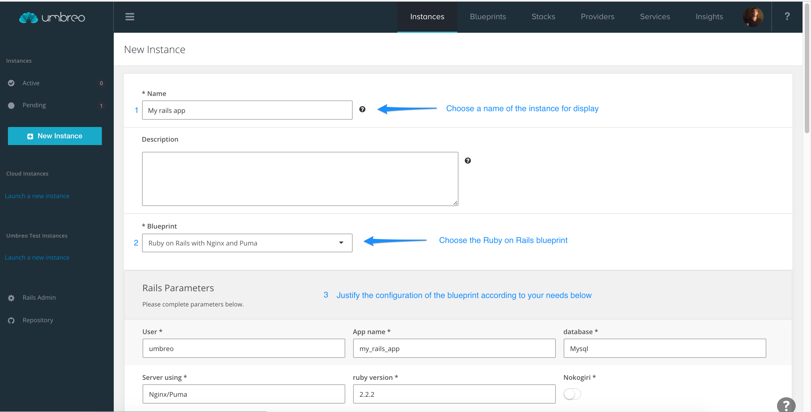
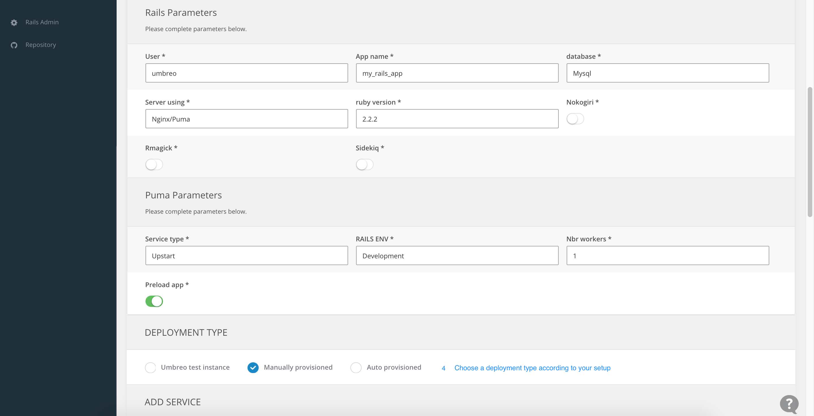
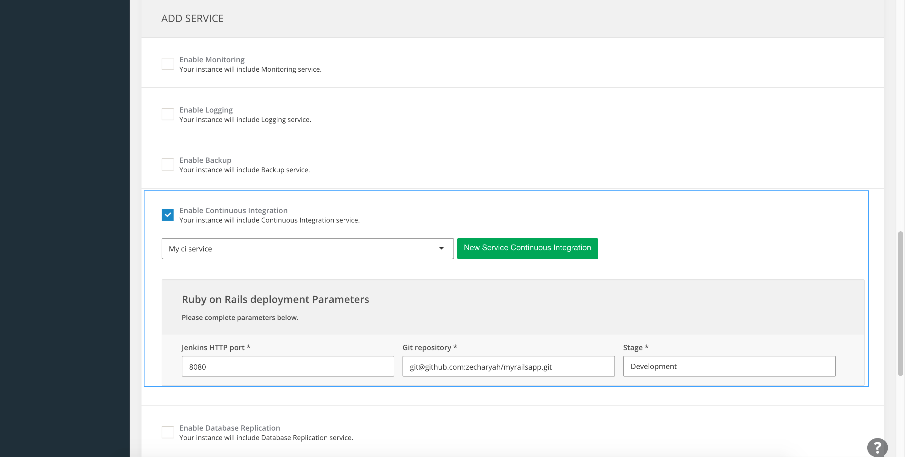
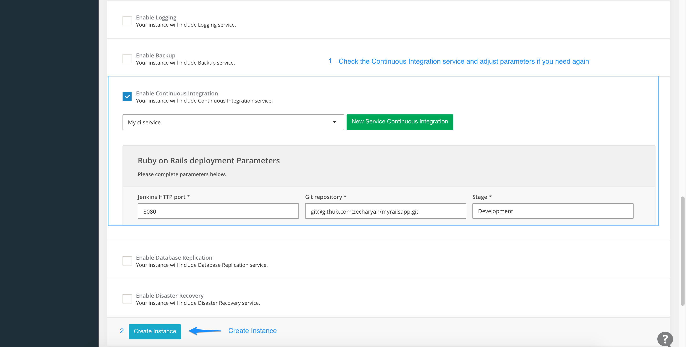

### Getting Started
In this tutorial, we gonna learn how to deploy a Ruby on Rails app using Jenkins and Capistrano using the free version of [**Umbreo**](https://www.umbreo.com/signup).

**Requirements:**

- Ruby on Rails app hosted in a code repository
- Understanding Deployment Types in Umbreo

## **Setting up the CI Server**

Log into your Umbreo dashboard and open your [**Services**](https://www.umbreo.com/user_services) page and start deploying a service by clicking on "Deploy Service" Button.

 
Choose **Continous Integration** Service category.
<!-- 

 -->

 
Choose **Ruby on Rails deployment** Service.

 
Fill the form with the appropriate information.

 
Choose a deployment type. Read more about types of deployments here.

 
Go back to your Services page and make sure your service is ready.

 
Deploy your service on a server.
<!-- 

 -->

---------

## **Setting up the Rails server**

Log into your Umbreo dashboard and open your [**Instances**](https://www.umbreo.com/instances) page and start creating an instance by clicking on "New Instance" Button.

 
Fill the form with the appropriate information.

 
Choose a deployment type. Read more about types of deployments here.

 
Enable **Continuous Integration** and select the service you just created.

 
You can adjust the parameters of the service you created before. And then confirm by clicking "Create Instance" Button.

 
Deploy your instance on a server and you're all set!
<!-- 

 -->

